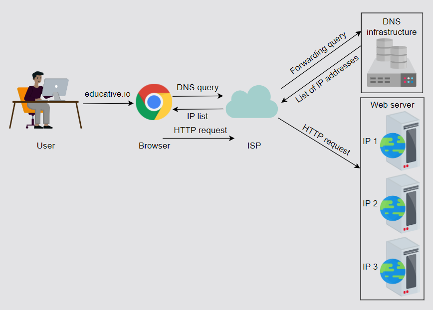
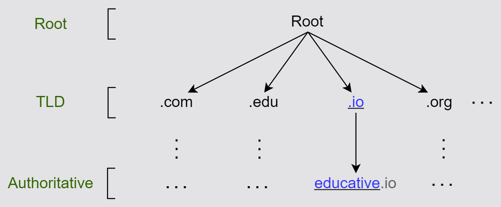
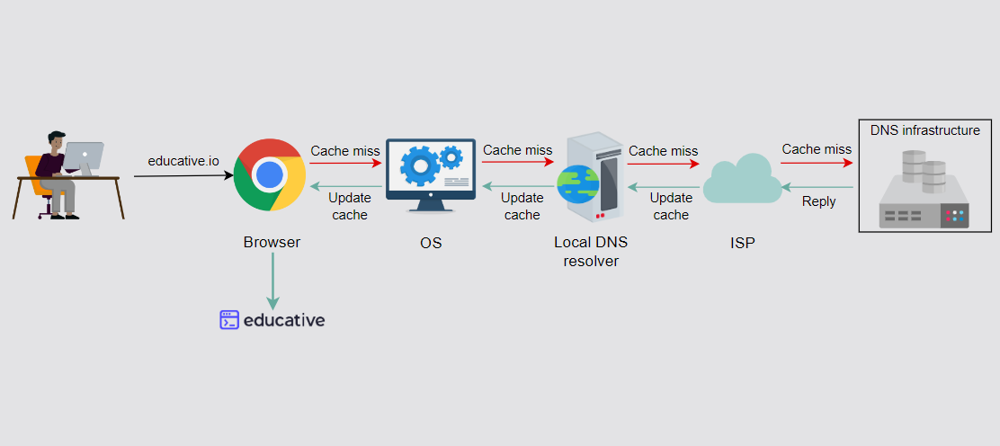

# Domain Name System (DNS)

- The Domain Name System (DNS) is the Internet’s naming service that maps human-friendly domain names to machine-readable IP addresses.

 

- Below image demonstrates high-level flow of the working of DNS:
  

 

- It’s important to understand that the DNS isn’t a single server. It’s a complete infrastructure with numerous servers. DNS servers that respond to users’ queries are called name servers.

 

## DNS Hierarchy

- There are mainly 4 types of servers in the DNS hierarchy:

1. **DNS resolver:** Resolvers initiate the querying sequence and forward requests to the other DNS name servers. Typically, DNS resolvers lie within the premise of the user’s network. However, DNS resolvers can also cater to users’ DNS queries through caching techniques, as we will see shortly. These servers can also be called local or default servers.

 

2. **Root-level name servers:** These servers receive requests from local servers. Root name servers maintain name servers based on top-level domain names, such as .com, .edu, .us, and so on. For instance, when a user requests the IP address of educative.io, root-level name servers will return a list of top-level domain (TLD) servers that hold the IP addresses of the .io domain.

 

3. **Top-level domain(TLD) name servers:** These servers hold the IP addresses of authoritative name servers. The querying party will get a list of IP addresses that belong to the authoritative servers of the organization.

 

4. **Authoritative name servers:** These are the organization’s DNS name servers that provide the IP addresses of the web or application servers.

 

 

## Caching

- Caching refers to the temporary storage of frequently requested resource records. A record is a data unit within the DNS database that shows a name-to-value binding. Caching reduces response time to the user and decreases network traffic. When we use caching at different hierarchies, it can reduce a lot of querying burden on the DNS infrastructure. Caching can be implemented in the browser, operating systems, local name server within the user’s network, or the ISP’s DNS resolvers.

 

- Below image demonstrates the power of caching in the DNS:

 

